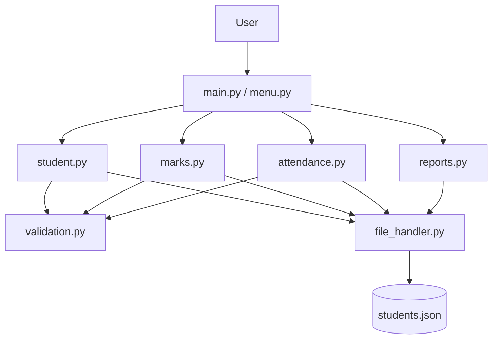

# System Architecture Diagram

```mermaid
flowchart TD
    U[User] --> M[main.py / menu.py]
    M --> S[student.py]
    M --> MK[marks.py]
    M --> A[attendance.py]
    M --> R[reports.py]
    S --> V[validation.py]
    MK --> V
    A --> V
    S --> F[file_handler.py]
    MK --> F
    A --> F
    R --> F
    F --> J[(students.json)]
```
