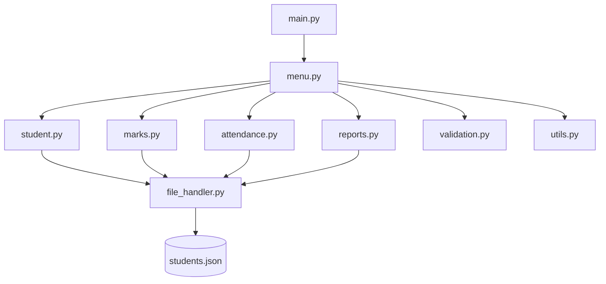

# Component Diagram

```mermaid
flowchart TB
    MAIN[main.py]
    MENU[menu.py]
    STUDENT[student.py]
    MARKS[marks.py]
    ATTEND[attendance.py]
    REPORTS[reports.py]
    VALID[validation.py]
    FILE[file_handler.py]
    UTILS[utils.py]
    DATA[(students.json)]

    MAIN --> MENU
    MENU --> STUDENT
    MENU --> MARKS
    MENU --> ATTEND
    MENU --> REPORTS
    MENU --> VALID
    MENU --> UTILS
    STUDENT --> FILE
    MARKS --> FILE
    ATTEND --> FILE
    REPORTS --> FILE
    FILE --> DATA
```
