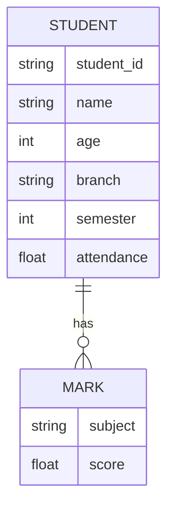

# Storage / ER Diagram

The project uses JSON instead of a relational database. The logical data model is:



Example JSON structure:

```json
{
  "S101": {
    "name": "Rahul Sharma",
    "age": 18,
    "branch": "CSE",
    "semester": 1,
    "marks": {
      "Python": 88,
      "Mathematics": 82
    },
    "attendance": 86
  }
}
```
