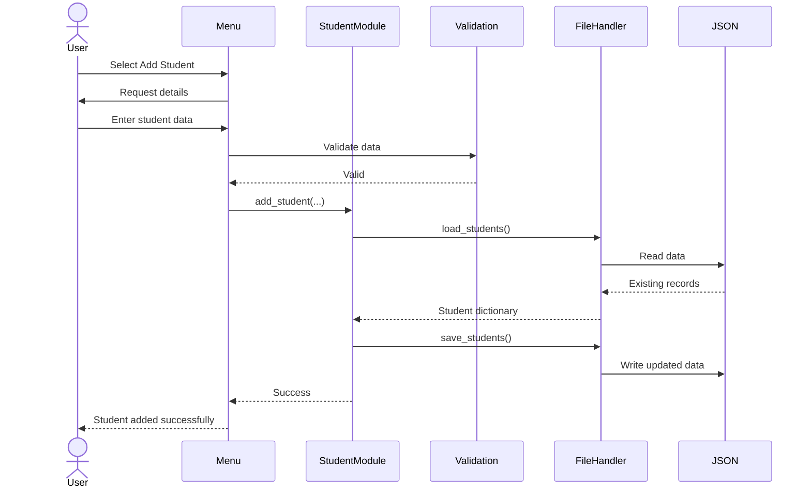

# Sequence Diagram

```mermaid
sequenceDiagram
    actor User
    participant Menu
    participant StudentModule
    participant Validation
    participant FileHandler
    participant JSON

    User->>Menu: Select Add Student
    Menu->>User: Request details
    User->>Menu: Enter student data
    Menu->>Validation: Validate data
    Validation-->>Menu: Valid
    Menu->>StudentModule: add_student(...)
    StudentModule->>FileHandler: load_students()
    FileHandler->>JSON: Read data
    JSON-->>FileHandler: Existing records
    FileHandler-->>StudentModule: Student dictionary
    StudentModule->>FileHandler: save_students()
    FileHandler->>JSON: Write updated data
    StudentModule-->>Menu: Success
    Menu-->>User: Student added successfully
```
