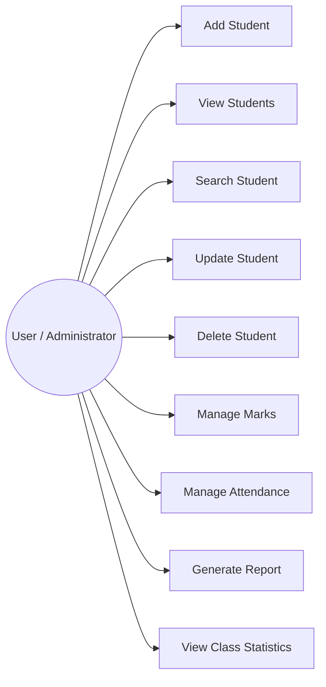

# Use Case Diagram

```mermaid
flowchart LR
    U((User / Administrator))
    A[Add Student]
    B[View Students]
    C[Search Student]
    D[Update Student]
    E[Delete Student]
    F[Manage Marks]
    G[Manage Attendance]
    H[Generate Report]
    I[View Class Statistics]

    U --> A
    U --> B
    U --> C
    U --> D
    U --> E
    U --> F
    U --> G
    U --> H
    U --> I
```
