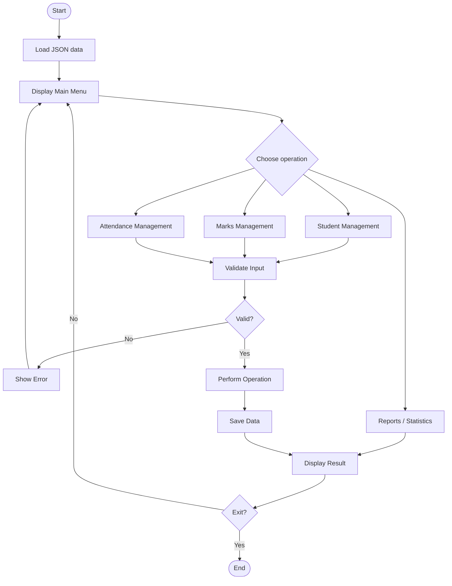

# Workflow Diagram

```mermaid
flowchart TD
    A([Start]) --> B[Load JSON data]
    B --> C[Display Main Menu]
    C --> D{Choose operation}
    D --> E[Student Management]
    D --> F[Marks Management]
    D --> G[Attendance Management]
    D --> H[Reports / Statistics]
    E --> I[Validate Input]
    F --> I
    G --> I
    H --> J[Display Result]
    I --> K{Valid?}
    K -- No --> L[Show Error]
    L --> C
    K -- Yes --> M[Perform Operation]
    M --> N[Save Data]
    N --> J
    J --> O{Exit?}
    O -- No --> C
    O -- Yes --> P([End])
```
